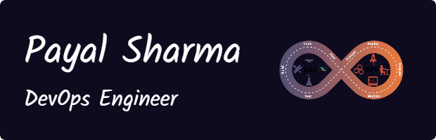

## 📋 Profile Summary

Hello!! I am Payal Sharma, an aspiring AWS DevOps Engineer with a BCA background. I have a deep interest in developing scalable, secure, and efficient cloud-based solutions. My technical expertise includes working with core AWS services, implementing containerization with Docker, and orchestrating deployments using Kubernetes. I am well-versed in automation tools such as Jenkins and GitHub Actions and proficient in Infrastructure as Code using Terraform. I am committed to optimizing cloud infrastructure, streamlining deployment workflows, and driving continuous improvement through DevOps best practices.

---

## 🔧 Skills & Technologies

<table align="center">
  <tr>
    <td align="center" width="96">
      
       AWS
    </td>
    <td align="center" width="96">
      
       Kubernetes
    </td>
    <td align="center" width="96">
      
       Docker
    </td>
    <td align="center" width="96">
      
       Terraform
    </td>
    <td align="center" width="96">
      
       Git
    </td>
    <td align="center" width="96">
      
       Jenkins
    </td>
    <td align="center" width="96">
      
       GitHub
    </td>
  </tr>
  <tr>
    <td align="center" width="96">
      
       Python
    </td>
    <td align="center" width="96">
      
       C
    </td>
    <td align="center" width="96">
      
       C++
    </td>
    <td align="center" width="96">
      
       Java
    </td>
    <td align="center" width="96">
      
       C#
    </td>
    <td align="center" width="96">
      
       Bash
    </td>
    <td align="center" width="96">
      
       Linux
    </td>
    </tr>
  <tr>
    <td align="center" width="96">
      
       HTML
    </td>
    <td align="center" width="96">
      
       CSS
    </td>
    <td align="center" width="96">
      
       MySQL
    </td>
    <td align="center" width="96">
      
       Grafana
    </td>
    <td align="center" width="96">
      
       Prometheus
    </td>
    <td align="center" width="96">
      
       Ansible
    </td>
    
  </tr>
</table>

## 📊 Stats

  

  
  

## 🏆 Key Projects

### 🚀 [CI/CD Pipeline for Strapi on AWS ECS (Fargate)](https://github.com/roohmeiy/Strapi-Deployment)
Designed a zero-downtime CI/CD pipeline using GitHub Actions and Terraform to deploy a Strapi app on AWS ECS Fargate with Blue-Green deployment. Provisioned AWS infrastructure (VPC, subnets, ECS, IAM, ALB) using Terraform. Automated app build, ECR image push, and ECS deployment via GitHub Actions.  
**Focus:** Monitoring, reliability, and rollback strategies for production readiness.  
**Tech Stack:** GitHub Actions, Terraform, AWS ECS (Fargate), ECR

### 🚀 [CI/CD Pipeline for Kubernetes Deployment using Helm](https://github.com/roohmeiy/todo-app-nodejs)
Developed a CI/CD pipeline with GitHub Actions for automated testing, Docker image builds, and Kubernetes deployment using Helm. Included dynamic image tagging, secure config handling, and email alerts on pipeline events.  
**Tech Stack:** GitHub Actions, Docker, Kubernetes, Helm, YAML, Git

### 🧹 [Automated EBS Snapshot Cleanup with AWS Lambda](https://github.com/roohmeiy/aws-lambda/blob/main/delete_idle_ebs_vol.py)
Built an AWS Lambda function in Python using Boto3 to automatically delete outdated EBS snapshots. Reduced storage costs by 20% and eliminated manual snapshot management.  
**Tech Stack:** AWS Lambda, Python, Boto3  
**Outcome:** Optimized resource usage and improved operational efficiency.

### 🌱 [Ecozone – Clean Energy Awareness Website](https://github.com/roohmeiy/ecozone)
Ecozone is a responsive website that educates users about clean energy sources like solar, wind, and hydro power. It features a user-friendly interface, smooth navigation, and informative content to promote environmental awareness.  
**Tech Stack:** HTML, CSS, JavaScript

### 🔐 [Secure DevSecOps Pipeline for Hotstar Clone](https://github.com/roohmeiy/Hotstar-Clone)
Built a secure CI/CD pipeline for deploying a Hotstar clone to AWS EKS using Kubernetes. Integrated SonarQube, OWASP Dependency Check, and Docker Scout for code and container security. Automated EC2 setup and post-deployment cleanup using shell scripting and Terraform.  
**Tech Stack:** Jenkins, SonarQube, Docker, Kubernetes, AWS (EKS, EC2, IAM), Terraform, Shell

## 🎓 Education

### Bachelor of Computer Applications (BCA)
#### MDU | Expected May 2025
- 🎯 CGPA: 8.1

## 📫 Connect With Me

  
  
  
  

## 📈 Contribution Graph

  

  
Thanks for visiting my profile! Feel free to check out my repositories and connect with me.

